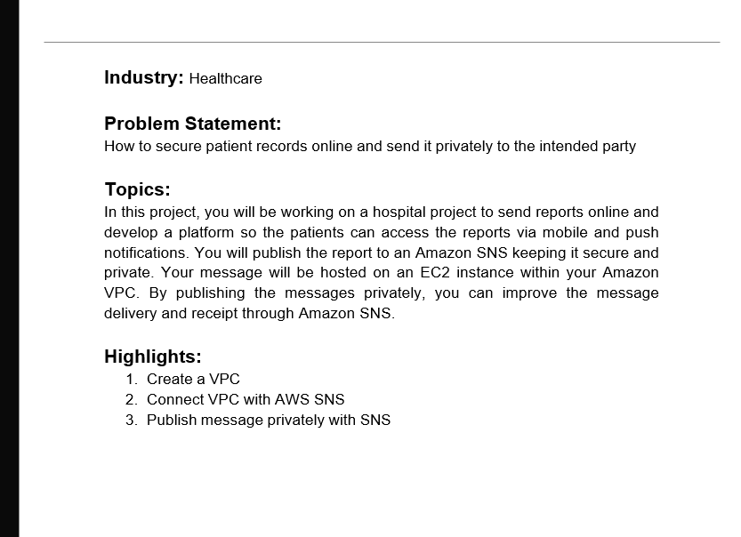
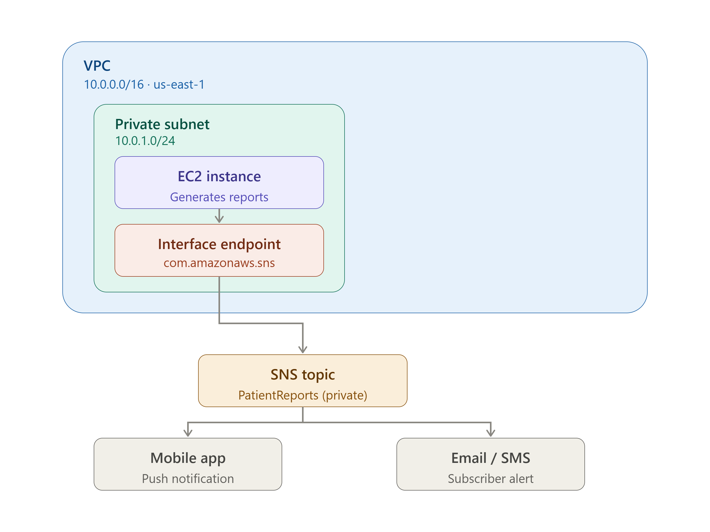
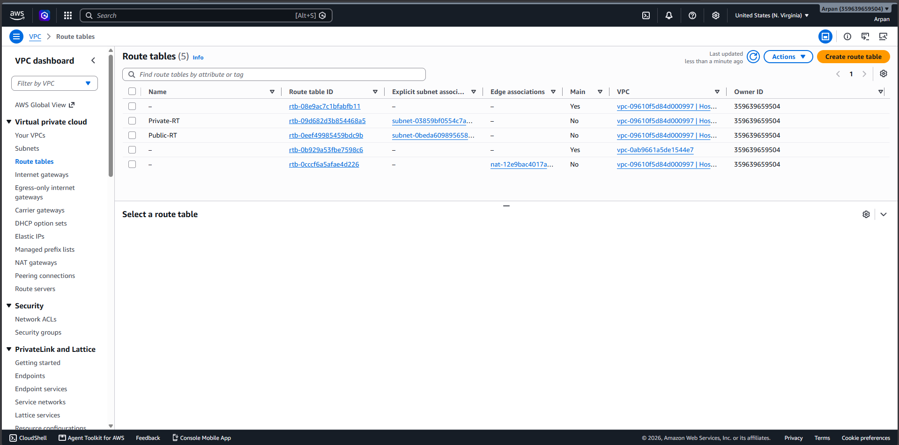
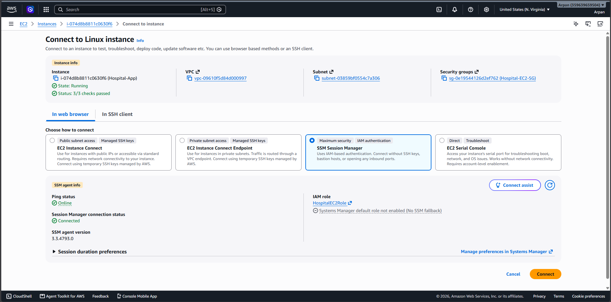
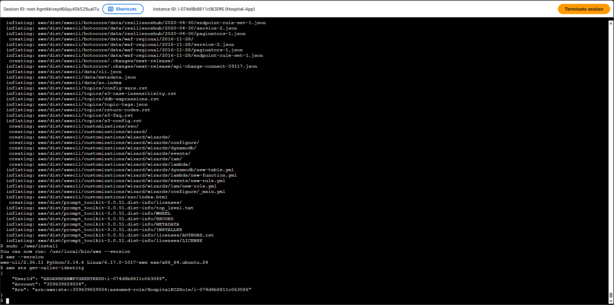
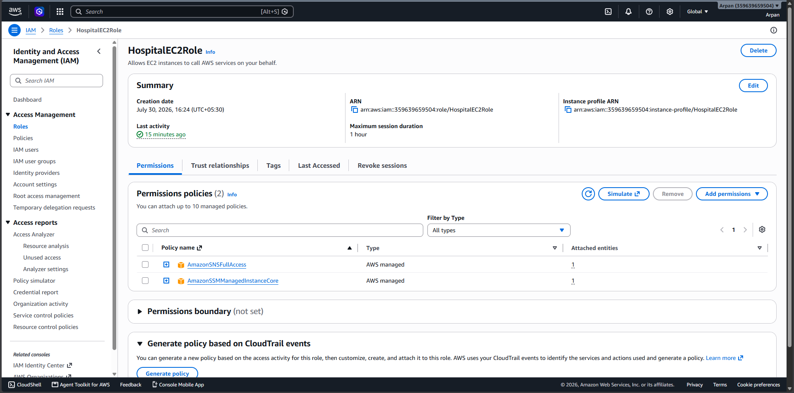
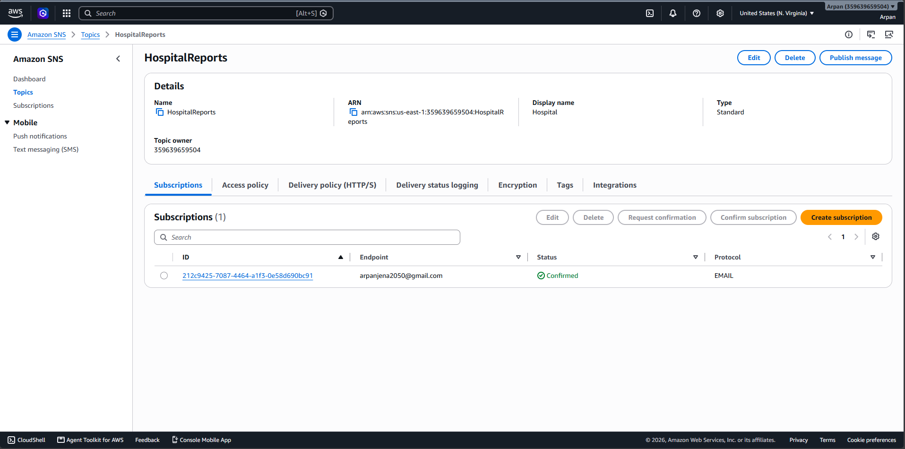
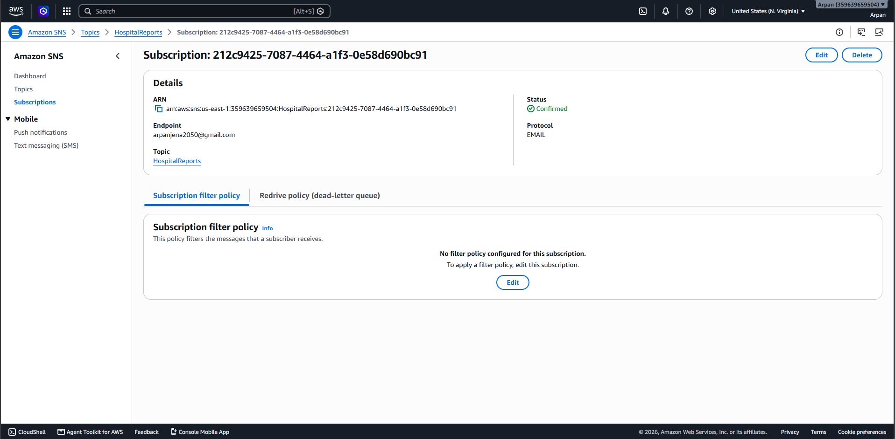
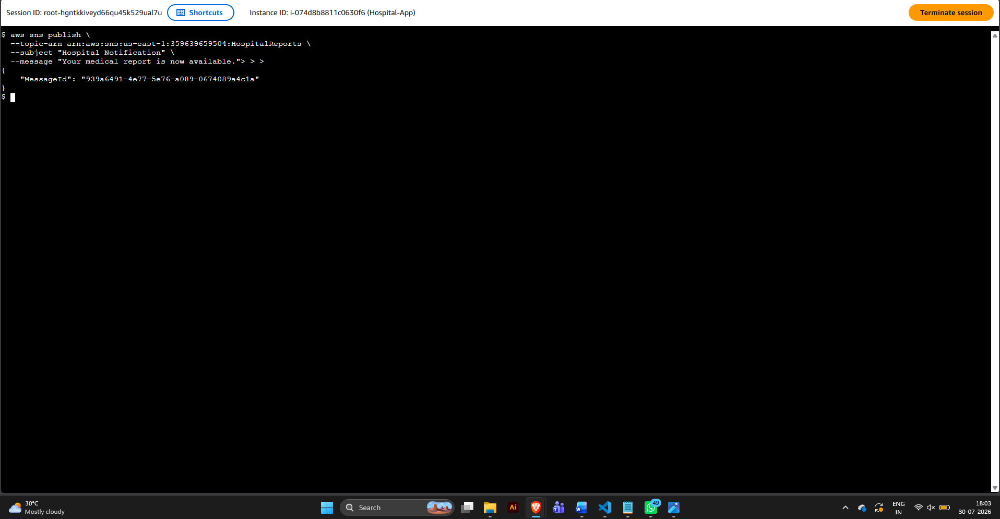
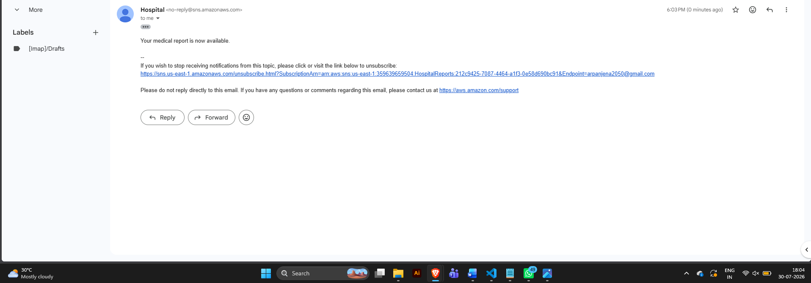

<div align="center">

# 🏥 AWS Hospital Notification System

### Secure Patient Report Notification System using Terraform, Amazon VPC, EC2, IAM, Systems Manager & Amazon SNS


---

### 🚀 Secure AWS Infrastructure for Private Healthcare Notifications

Built with **Terraform** following **AWS Security Best Practices**

</div>

---

# 📑 Table of Contents

- [Project Overview](#-project-overview)
- [Problem Statement](#-problem-statement)
- [Project Objectives](#-project-objectives)
- [Solution Architecture](#-solution-architecture)
- [AWS Services Used](#-aws-services-used)
- [Project Features](#-project-features)
- [Folder Structure](#-folder-structure)
- [Infrastructure Workflow](#-infrastructure-workflow)
- [Architecture Diagram](#-architecture-diagram)
- [Deployment Guide](#-deployment-guide)
- [Screenshots](#-screenshots)
- [Security Implementation](#-security-implementation)
- [Testing & Validation](#-testing--validation)
- [Future Improvements](#-future-improvements)
- [Author](#-author)

---

# 📖 Project Overview

Healthcare organizations handle sensitive patient records that must be delivered securely to patients.

This project demonstrates how to deploy a **secure AWS infrastructure** where a hospital application running on an **Amazon EC2 instance inside a private subnet** sends patient report notifications using **Amazon SNS**.

The infrastructure is completely isolated inside a custom Amazon VPC and follows AWS networking and security best practices.

The complete infrastructure is provisioned using **Terraform**.

---

# ❗ Problem Statement

The objective of this project is to securely publish patient report notifications from a private AWS infrastructure while ensuring that patient data is not exposed over the public internet.

Patients receive notifications whenever their reports become available.

## Problem Statement



---

# 🎯 Project Objectives

✔ Build a custom Amazon VPC

✔ Deploy EC2 in a Private Subnet

✔ Configure Internet Gateway & NAT Gateway

✔ Implement Secure Routing

✔ Configure IAM Role Authentication

✔ Access EC2 using Systems Manager Session Manager

✔ Install AWS CLI inside Private EC2

✔ Create Amazon SNS Topic

✔ Subscribe Patient Email

✔ Publish Notifications Securely

✔ Receive Email Notifications Successfully

✔ Provision Infrastructure using Terraform

---

# ☁ AWS Services Used

| AWS Service | Purpose |
|-------------|---------|
| Amazon VPC | Create isolated network |
| Public Subnet | Host NAT Gateway |
| Private Subnet | Secure EC2 Deployment |
| Internet Gateway | Internet connectivity |
| NAT Gateway | Outbound internet for private subnet |
| Route Tables | Network routing |
| Security Groups | Firewall |
| Amazon EC2 | Hospital Application Server |
| IAM Role | Secure AWS Authentication |
| AWS Systems Manager | Secure EC2 Access |
| Amazon SNS | Email Notification |
| Terraform | Infrastructure as Code |

---

# ⭐ Project Features

## Networking

- Custom VPC
- Public Subnet
- Private Subnet
- Internet Gateway
- NAT Gateway
- Route Tables

---

## Security

- Private EC2 Instance
- No Public IP
- IAM Role Authentication
- Session Manager
- Security Groups
- Least Privilege Access

---

## Notification

- Amazon SNS Topic
- Email Subscription
- Secure Notification Delivery

---

## Infrastructure as Code

- Terraform
- Modular Configuration
- Variables
- Outputs

---

# 📂 Folder Structure

```text
AWS-Hospital-Notification-System
│
├── terraform/
│   ├── provider.tf
│   ├── variables.tf
│   ├── vpc.tf
│   ├── subnet.tf
│   ├── route.tf
│   ├── outputs.tf
│
├── screenshots/
│
├── diagrams/
│
├── README.md


```

Project Folder



---

# 🔄 Infrastructure Workflow

(diagrams/infradiagram.png)

# 🏗 Solution Architecture

The infrastructure follows AWS recommended networking architecture.

- Internet Gateway provides internet access.
- NAT Gateway allows outbound connectivity.
- EC2 remains inside a Private Subnet.
- IAM Role securely authenticates AWS API requests.
- Systems Manager provides secure terminal access.
- Amazon SNS delivers patient notifications.

- # 🏗️ Architecture Diagram

The following architecture illustrates the complete workflow of the Hospital Notification System.

> **📌 Replace the placeholder image below with your architecture diagram once you create it.**

```text
                              Internet
                                  │
                           Internet Gateway
                                  │
                    ┌────────────────────────┐
                    │     Public Subnet      │
                    │                        │
                    │     NAT Gateway        │
                    └──────────┬─────────────┘
                               │
══════════════════════════════════════════════════════════════
                      Hospital VPC (10.0.0.0/16)
══════════════════════════════════════════════════════════════
                               │
                    ┌────────────────────────┐
                    │    Private Subnet      │
                    │                        │
                    │  Ubuntu EC2 Instance   │
                    │ (Hospital Application) │
                    └──────────┬─────────────┘
                               │
                         IAM Role
                               │
                        Amazon SNS
                               │
                    Email Notification
                               │
                           Patient
```

---

# 🚀 Deployment Guide

## Step 1: Create a Custom VPC

A custom Amazon VPC was created to isolate the hospital application from the public internet.

### Configuration

| Resource | Value |
|----------|-------|
| VPC CIDR | 10.0.0.0/16 |
| Region | us-east-1 |

### Why?

- Provides complete network isolation.
- Allows creation of public and private subnets.
- Forms the foundation of the secure infrastructure.

---

## Step 2: Create Public and Private Subnets

Two subnets were created.

| Subnet | Purpose |
|---------|----------|
| Public Subnet | Hosts NAT Gateway |
| Private Subnet | Hosts EC2 Instance |

The EC2 instance is deployed inside the private subnet so it cannot be accessed directly from the internet.

---

## Step 3: Configure Internet Gateway

An Internet Gateway was attached to the VPC.

### Purpose

- Provides internet connectivity for public resources.
- Required by the NAT Gateway.

---

## Step 4: Configure NAT Gateway

The NAT Gateway was deployed inside the public subnet.

### Purpose

- Allows outbound internet access from the private subnet.
- Prevents inbound internet access.

### Screenshot



---

## Step 5: Configure Route Tables

### Public Route Table

Destination

```text
0.0.0.0/0
```

Target

```text
Internet Gateway
```

---

### Private Route Table

Destination

```text
0.0.0.0/0
```

Target

```text
NAT Gateway
```

### Why?

This configuration allows the EC2 instance to install packages and communicate with AWS services without exposing it to the internet.

---

# 🖥️ Step 6: Launch EC2 Instance

An Ubuntu EC2 instance was launched inside the private subnet.

### Configuration

| Setting | Value |
|----------|-------|
| AMI | Ubuntu 24.04 LTS |
| Instance Type | t2.micro |
| Network | Private Subnet |
| Public IP | Disabled |

### Why?

The application server remains isolated from public access while still having outbound internet connectivity.

---

# 🔐 Step 7: Configure Security Groups

Inbound Rules

| Type | Source |
|------|--------|
| SSH | Not Required |
| HTTP | As Required |

Outbound Rules

```text
Allow All Traffic
```

### Security Benefits

- No public SSH access.
- Traffic restricted using Security Groups.
- Access handled through AWS Systems Manager.

---

# 🔑 Step 8: Attach IAM Role

The EC2 instance was attached with an IAM Role instead of storing AWS credentials.

### Attached Policies

- AmazonSNSFullAccess
- AmazonSSMManagedInstanceCore

### Why?

Using IAM Roles eliminates the need to store AWS Access Keys inside the EC2 instance.

---

# 💻 Step 9: Connect using Session Manager

Instead of SSH, AWS Systems Manager Session Manager was used.

### Advantages

- No SSH key required.
- No Bastion Host required.
- No Port 22 exposed.
- Secure browser-based terminal.

### Screenshot



---

# ⚙️ Step 10: Install AWS CLI

AWS CLI Version 2 was installed inside the private EC2 instance.

### Installation

```bash
curl "https://awscli.amazonaws.com/awscli-exe-linux-x86_64.zip" -o awscliv2.zip

unzip awscliv2.zip

sudo ./aws/install
```

### Verification

```bash
aws --version
```

### Screenshot



---

# 🔍 Step 11: Verify IAM Role

The EC2 instance was verified to be using the attached IAM Role.

### Command

```bash
aws sts get-caller-identity
```

### Expected Output

```text
Account: 359639659504

Role:
HospitalEC2Role
```

### Screenshot



---

# 📋 Terraform Commands

The infrastructure can be provisioned using the following Terraform commands.

```bash
terraform init
```

Initializes the Terraform working directory.

---

```bash
terraform validate
```

Validates the Terraform configuration.

---

```bash
terraform plan
```

Displays the execution plan before creating infrastructure.

---

```bash
terraform apply
```

Creates the AWS infrastructure.

---

```bash
terraform destroy
```

Deletes all resources created by Terraform.
# 📧 Amazon SNS Configuration

Amazon Simple Notification Service (SNS) was used to send patient report notifications from the private EC2 instance to subscribed email addresses.

The EC2 instance securely publishes messages using its IAM Role without storing AWS credentials.

---

# 📌 Step 12: Create SNS Topic

An SNS Topic named **HospitalReports** was created.

### Command

```bash
aws sns create-topic --name HospitalReports
```

### Purpose

The SNS Topic acts as a communication channel between the Hospital Application and patients.

### Screenshot



---

# 📬 Step 13: Subscribe Email

A patient email address was subscribed to the SNS Topic.

### Command

```bash
aws sns subscribe \
  --topic-arn <YOUR_TOPIC_ARN> \
  --protocol email \
  --notification-endpoint your-email@example.com
```

After subscribing, AWS sends a confirmation email.

The user must click **Confirm Subscription** before receiving notifications.

### Screenshot



---

# 📤 Step 14: Publish Notification

Once the subscription was confirmed, the EC2 instance published notifications using AWS CLI.

### Command

```bash
aws sns publish \
  --topic-arn <YOUR_TOPIC_ARN> \
  --subject "Hospital Notification" \
  --message "Your medical report is now available."
```

### Successful Output

```text
{
   "MessageId": "xxxxxxxxxxxxxxxxxxxxxxxx"
}
```

### Screenshot



---

# 📩 Step 15: Email Notification

After publishing the message, Amazon SNS successfully delivered the notification to the subscribed email address.

### Screenshot



---

# 🔄 End-to-End Workflow

```text
                Patient Report Generated
                          │
                          ▼
             Hospital Application (EC2)
                          │
                          ▼
                  IAM Role Authentication
                          │
                          ▼
                  Amazon SNS Topic
                          │
                          ▼
                 Email Subscription
                          │
                          ▼
                Patient Receives Email
```

---

# 🧪 Testing & Validation

The following tests were performed to verify the infrastructure.

---

## ✅ Test 1: Verify AWS CLI

```bash
aws --version
```

Expected Result

```text
aws-cli/2.x.x
```

---

## ✅ Test 2: Verify IAM Role

```bash
aws sts get-caller-identity
```

Expected Result

```text
Arn:
arn:aws:sts::<ACCOUNT_ID>:assumed-role/HospitalEC2Role/...
```

---

## ✅ Test 3: Verify SNS Topic

```bash
aws sns list-topics
```

Expected Result

```text
HospitalReports
```

---

## ✅ Test 4: Verify Subscription

```bash
aws sns list-subscriptions-by-topic \
--topic-arn <YOUR_TOPIC_ARN>
```

Expected Result

```text
Confirmed
```

---

## ✅ Test 5: Publish Notification

```bash
aws sns publish \
--topic-arn <YOUR_TOPIC_ARN> \
--subject "Hospital Notification" \
--message "Patient report is ready."
```

Expected Result

Patient receives an email notification.

---

# 🔒 Security Implementation

Security was one of the primary goals while designing this infrastructure.

The following AWS best practices were implemented.

---

## Private EC2 Instance

The application server is deployed inside a Private Subnet.

✔ No Public IP

✔ Internet inaccessible

✔ Internal communication only

---

## IAM Role Authentication

Instead of storing AWS Access Keys, the EC2 instance uses an IAM Role.

Benefits

- Temporary Credentials
- Automatic Credential Rotation
- No Secret Keys Stored

---

## Systems Manager Session Manager

Remote administration is performed using AWS Systems Manager.

Benefits

- No SSH Keys
- No Port 22
- Browser-based Access
- IAM Controlled Access

---

## Security Groups

Security Groups restrict inbound traffic.

Current configuration

- No public SSH access
- Only required outbound traffic

---

## NAT Gateway

The NAT Gateway enables outbound internet connectivity while blocking inbound internet access.

Benefits

- Software installation
- AWS API access
- Increased security

---

# 📊 Infrastructure Summary

| Component | Status |
|------------|--------|
| Custom VPC | ✅ |
| Public Subnet | ✅ |
| Private Subnet | ✅ |
| Internet Gateway | ✅ |
| NAT Gateway | ✅ |
| Route Tables | ✅ |
| Security Groups | ✅ |
| Ubuntu EC2 | ✅ |
| IAM Role | ✅ |
| Session Manager | ✅ |
| AWS CLI | ✅ |
| Amazon SNS | ✅ |
| Email Subscription | ✅ |
| Notification Delivery | ✅ |

---

# 💰 AWS Cost Considerations

This project was designed using AWS Free Tier eligible resources wherever possible.

Resources that may incur charges:

- NAT Gateway
- Elastic IP
- SNS (after Free Tier)
- Data Transfer

Always destroy unused infrastructure to avoid unexpected costs.

---

# 🧹 Cleanup

Destroy all resources using Terraform.

```bash
terraform destroy
```

This removes all AWS resources created during the project.
# 🚀 Future Enhancements

This project demonstrates the foundation of a secure AWS notification system. The following features can be added in future versions.

## Infrastructure

- Auto Scaling Group
- Application Load Balancer
- Multi-AZ Deployment
- Amazon RDS Database
- Route 53 DNS

---

## Monitoring

- Amazon CloudWatch Metrics
- CloudWatch Alarms
- SNS Alerts
- CloudTrail Logging
- AWS Config

---

## Security

- AWS WAF
- AWS Shield
- Amazon GuardDuty
- AWS Secrets Manager
- KMS Encryption

---

## DevOps

- GitHub Actions
- Jenkins CI/CD Pipeline
- Docker
- Kubernetes (Amazon EKS)
- Terraform Modules

---

## Healthcare Features

- Store Patient Reports in Amazon S3
- Generate Pre-Signed URLs
- Secure Report Download
- SMS Notifications
- Mobile App Integration

---

# 📚 Learning Outcomes

This project helped me gain practical experience with the following AWS and DevOps concepts.

## Networking

- Custom Amazon VPC
- CIDR Planning
- Public & Private Subnets
- Route Tables
- Internet Gateway
- NAT Gateway

---

## Compute

- Amazon EC2
- Ubuntu Server
- Session Manager
- AWS CLI

---

## Security

- IAM Roles
- Security Groups
- Least Privilege Access
- Private Networking

---

## Messaging

- Amazon SNS
- Email Subscription
- Publish Notifications

---

## Infrastructure as Code

- Terraform
- Resource Dependencies
- Variables
- Outputs
- State Management

---

# 🐞 Troubleshooting

## EC2 Session Manager Not Connecting

Possible Reasons

- IAM Role Missing
- SSM Agent Not Installed
- No Internet or NAT Gateway
- Security Group Misconfiguration

Solution

- Attach AmazonSSMManagedInstanceCore Policy
- Verify NAT Gateway
- Verify Route Tables
- Restart SSM Agent

---

## AWS CLI Not Found

Solution

```bash
curl "https://awscli.amazonaws.com/awscli-exe-linux-x86_64.zip" -o awscliv2.zip

unzip awscliv2.zip

sudo ./aws/install
```

---

## SNS Email Not Received

Possible Reasons

- Email Subscription Not Confirmed
- Wrong Topic ARN
- Email in Spam Folder

Solution

- Confirm Subscription
- Verify Topic ARN
- Publish Again

---

## IAM Role Not Working

Verification

```bash
aws sts get-caller-identity
```

Expected Output

```
HospitalEC2Role
```

---

# 📖 References

AWS Documentation

- Amazon VPC
- Amazon EC2
- Amazon SNS
- IAM
- Systems Manager
- Terraform AWS Provider

---

# 📸 Project Screenshots

## Problem Statement


---

## Route Table


---

## Session Manager


---

## AWS CLI Installation


---

## IAM Role Verification


---

## SNS Topic


---

## SNS Subscription


---

## SNS Publish


---

## Email Notification


---

## Terraform Project Structure


---

# 📁 Repository Structure

```text
AWS-Hospital-Notification-System/
│
├── terraform/
│   ├── provider.tf
│   ├── variables.tf
│   ├── vpc.tf
│   ├── subnet.tf
│   ├── route.tf
│   ├── securitygroup.tf
│   ├── iam.tf
│   ├── ec2.tf
│   ├── sns.tf
│   ├── outputs.tf
│   └── terraform.tfvars.example
│
├── screenshots/
│   ├── 01-problem-statement.png
│   ├── 02-route-table.png
│   ├── 03-session-manager.png
│   ├── 04-aws-cli-installation.png
│   ├── 05-iam-role-verification.png
│   ├── 06-sns-topic.png
│   ├── 07-sns-subscription.png
│   ├── 08-sns-publish.png
│   ├── 09-email-notification.png
│   └── 10-project-structure.png
│
├── diagrams/
│   └── architecture.png
│
├── README.md
└── .gitignore
```

---

# 👨‍💻 Author

## Arpan Jena

**AWS | DevOps | Terraform | Linux | Git**

- GitHub: https://github.com/arpanbiki
- LinkedIn: *(Add your LinkedIn profile here)*

---

# ⭐ If you found this project useful

If you like this project, please consider giving it a ⭐ on GitHub.

It motivates me to build more AWS and DevOps projects.

---

<div align="center">

## ⭐ Thank You for Visiting ⭐

**Happy Learning 🚀**

</div>
